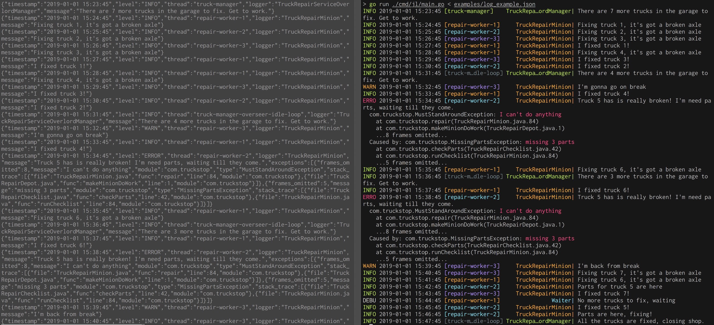

# jl

jl (JL) is a parser and formatter for JSON logs, making machine-readable JSON logs human readable again.



## Installing

```
go get -u github.com/mightyguava/jl/cmd/jl
```

## Usage

jl consumes from stdin and writes to stdout. To use jl, just pipe your JSON logs into jl. For example

```sh
./build/my-app-executable | jl
cat app-log.json | jl
```

jl itself doesn't support following log files, but since it can consume from a pipe, you can just use `tail`
```sh
tail -F app-log.json | jl
```

## Formatters

jl currently supports 2 formatters, with plans to make the formatters customizable.

The default is `-format compact`, which extracts only important fields from the JSON log, like `message`, `timestamp`, `level`, colorizes and presents them in a easy to skim way. It drops un-recongized fields from the logs.

The other option is `-format logfmt`, which formats the JSON logs in a way that closely resembles [logfmt](https://blog.codeship.com/logfmt-a-log-format-thats-easy-to-read-and-write/). This option will emit all fields from each log line.

Both formatters will echo non-JSON log lines as-is.
